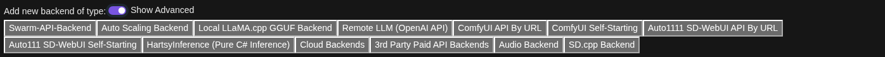
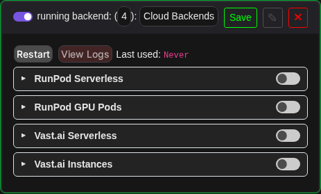
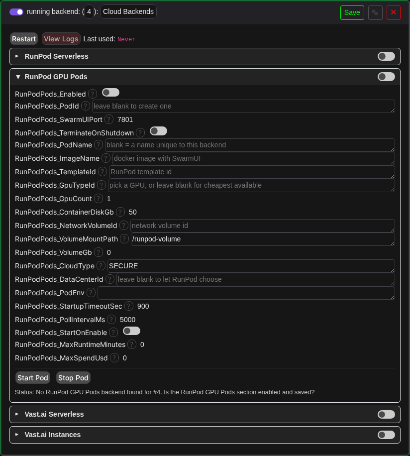

# SwarmUI-CloudBackends

Run your [SwarmUI](https://github.com/mcmonkeyprojects/SwarmUI) generations on cloud GPUs. Workers wake on demand when you generate and scale back to zero when idle, so you only pay while you are actually using a GPU.

The extension is modular by design: one shared core handles the SwarmUI side, and each cloud provider is a thin adapter. Adding a provider means implementing a small interface, not writing another backend.

This supersedes the older single provider extensions `SwarmUI-Runpod-Serverless-Backend` and `SwarmUI-Vast.AI-Serverless-Backend`. Do not install those alongside this one, as they collide on backend type IDs, permissions, API keys, and API route names.

## One backend, one entry point

**Server > Backends** has a single addable **Cloud Backends** type (behind *Show Advanced*), not four:



Adding it gives you one settings card with a collapsible section per provider (RunPod Serverless / RunPod GPU Pods / Vast.ai Serverless / Vast.ai Instances), each with its own enable toggle and fields, no API key fields in this card (those stay in **User Settings > API Keys** as always). The card is a pool manager: enabling a section makes that provider available, and an actual hidden backend is created **per user, on that user's own API key**, the first time the user generates (serverless) or presses Start (instances). The internal `runpod_serverless_hidden`/`runpod_pods_hidden`/`vastai_serverless_hidden`/`vastai_instance_hidden` backend types still exist, they just aren't independently addable or listed in the per-generation backend-type dropdown.

### Per-user backends

Every cloud backend belongs to exactly one user and runs on that user's own key:

* A user with no key on file gets a clean refusal ("No ... API key on file for user '...'"), never another user's worker or bill.
* A user's generations only route to (and are only accepted by) their own cloud backends - this holds for serverless workers and for the whole backend tree attached to a rented instance.
* Changing your API key takes effect on the next use automatically; no disable/re-enable cycle needed.
* A created pod/instance is remembered per user (in the user database) and reattached after a SwarmUI restart instead of creating a second billed one; find-by-name/label (unique per backend and user by default) covers the same case as a fallback. Under `--no_persist` (or if the backend is later renumbered via an ID edit) the remembered ID is not written/found, and find-by-name/label alone carries reattachment.
* Cost safety rule: an implicitly-created backend never spends money by itself. Serverless children never auto-refresh models (that wakes a billed worker - use the refresh button/route), and instance children never auto-start their instance (use Start).



The two "rent a whole instance" sections (RunPod GPU Pods, Vast.ai Instances) additionally get **Start** / **Stop** buttons with a live status line (state, GPU, cost/hr, uptime). Starting always confirms first (with a live price estimate when available, since either kind of instance bills continuously until stopped). Two optional failsafes are also available on each: auto-stop after N minutes of runtime, and/or once estimated spend (the provider's own reported hourly rate x uptime) crosses a cap you set - useful if you might forget to stop it yourself. Neither provider exposes a real-time spend API, so the estimate is computed locally rather than polled.



## Provider status

| Provider | Internal backend type | Status |
|---|---|---|
| RunPod Serverless | `runpod_serverless` | Supported. Verified end to end against real hardware, including generation. |
| RunPod Pods | `runpod_pods` | Supported. Verified end to end live: create a pod, attach it as a real Swarm backend, generate, Start/Stop, terminate. |
| Vast.ai Serverless | `vastai_serverless` | Built to the documented serverless contract. Config and credential handling verified against the live API; routing and generation are untested, since that needs a Vast account and a deployed worker. |
| Vast.ai Instances | `vastai_instance` | Built and verified against the official `vastai` Python SDK/CLI source (the prose docs are vague on the exact endpoints). Config/credential plumbing and the Start/Stop/confirm/error-surfacing UI flow are live-verified the same way RunPod Pods was; actual instance creation and networking are untested against a real Vast account, and creating a brand-new named network volume isn't supported yet (attaching an existing one is) - see "Known follow ups". |

## How it works

There are two shapes of provider here, because "wake a serverless worker per request" and "rent a whole instance that stays up" need different lifecycles.

**Serverless** (RunPod Serverless, Vast.ai) wakes a worker on the first generate and talks directly to its SwarmUI over HTTP:

```
  ICloudProvider                 CloudBackendBase : AbstractT2IBackend
    WakeupWorkerAsync    ---->     Wakes a GPU on the first generate, then talks
    StartKeepaliveAsync            directly to the remote SwarmUI's own HTTP API
    StopKeepaliveAsync             (GetNewSession, ListModels, SelectModel,
    ValidateAsync                  GenerateText2Image, GenerateText2ImageWS).

  CloudWorkerInfo { PublicUrl, SessionId, WorkerId, Version }
```

This deliberately does not reuse SwarmUI's built in `SwarmSwarmBackend`, which assumes the remote is reachable at startup and whose idle pings would keep a pay per second worker billing the whole time it is attached.

**Instance rental** (RunPod Pods) is the opposite shape: once a pod is running, it stays up until you stop it, so there is no reason to reimplement the remote protocol. This backend only drives the provider's API to get a pod running with SwarmUI on it, then hands the URL to core's own `SwarmSwarmBackend` and steps out of the way:

```
  ICloudInstanceProvider          CloudInstanceBackendBase : AbstractT2IBackend
    StartInstanceAsync   ---->      Starts (or creates) the instance, then attaches
    ReleaseInstanceAsync            core's SwarmSwarmBackend to its URL as a child.
    ValidateAsync                   That child does everything from there: sessions,
                                     model listing, generation, websockets, previews.

  CloudInstanceInfo { PublicUrl, InstanceId, Description }
```

Sessions, model sync, parameter forwarding and generation are core Swarm code either way, either called directly (serverless) or delegated to (pods). Nothing here reimplements the remote-Swarm protocol from scratch.

The extension plugs into SwarmUI's own systems rather than reinventing them:

* `CloudBackendsBackend` is the one publicly registered backend type; the three providers' own `BackendType` records are built without calling the public registry, so they're usable internally (as hidden children) without being independently addable. See `CloudBackendTypes`.
* API keys live in the per user key store under **User Settings > API Keys** (`runpod_api`, `vastai_api`).
* Serverless remote models are merged into the model browser through `ExtraModelProviders`, and generating with a cloud only model auto routes to the cloud backend. A pod's models reach the browser through core's own `remote_swarm` provider instead, since the attached `SwarmSwarmBackend` is a real backend as far as core is concerned.
* Permissions: `use_runpod_serverless`, `use_runpod_pods`, `use_vastai`, `use_vastai_instances`, and `cloudbackends_status`.
* Every action is reachable over the plain API (`CloudGetStatus`, `CloudRefreshModels`, `CloudStartPod`/`CloudStopPod`/`CloudGetPodStatus`, `VastAIStartInstance`/`VastAIStopInstance`/`VastAIGetInstanceStatus`, `CloudListProviders`), and the start/stop calls have websocket variants (`...WS`) that stream progress lines while a cold instance boots.

## Setup for RunPod Serverless

1. Deploy the worker: [RunPod-Worker-SwarmUI](https://github.com/HartsyAI/RunPod-Worker-SwarmUI), published as `kalebbroo/swarmui-runpod:latest`. The endpoint needs:
   * A network volume mounted at `/runpod-volume`, where SwarmUI and your models are installed on first boot.
   * A GPU with at least 16 GB VRAM, and roughly 15 GB of container disk.
   * An execution timeout comfortably above your keepalive duration (3600s is a safe default), and FlashBoot enabled.
2. In SwarmUI, open **User Settings > API Keys** and set your RunPod key.
3. Open **Server > Backends**, enable *Show Advanced*, and add **Cloud Backends** (once, if you haven't already). Expand the **RunPod Serverless** section, toggle it on, set `EndpointId`, and Save.
4. Initialization validates your key and endpoint against RunPod's health API before reporting as running, so a bad key or endpoint ID fails immediately with a clear message instead of at your first generation.

## Setup for RunPod Pods

A pod is a GPU you rent by the hour, so unlike serverless it bills continuously from the moment it starts until you stop it. `TerminateOnShutdown` controls what happens when the pod is stopped (via the Stop Pod button, disabling the section, or a failsafe tripping): off (the default) stops the pod so it can resume quickly, keeping its container disk (and its storage cost); on destroys it, which only makes sense when a network volume holds everything worth keeping.

`StartOnEnable` is off by default: toggling the section on and hitting Save does not itself start (or bill) a pod, it just makes the **Start Pod** button in that section usable. Turn `StartOnEnable` on if you want the pod created/resumed automatically whenever the backend initializes instead.

Set `PodId` to attach an existing pod, or leave it blank and set `ImageName` (or `TemplateId`) so one can be created. Leave `PodName` blank too (recommended) - it defaults to a name unique to this backend, so creating looks for a pod already under that name before making a new one, and two separate Cloud Backends entries can't collide on the same pod name.

Once you have a RunPod API key set in **User Settings > API Keys**, opening **Server > Backends** with *Show Advanced* on turns the GPU type, network volume, data center, template and pod ID fields into dropdowns populated live from your account, showing real availability and hourly price instead of asking you to type an exact GPU name from memory. Leaving GPU type on its blank "(cheapest available)" entry asks RunPod's catalog which GPUs are actually available for pods and tries them cheapest first; this matters because the API places exactly one GPU type per creation request and does not fall back on its own, so naming a single busy GPU type simply fails.

The pod's image must serve SwarmUI on `SwarmUIPort`, exposed as an http port so RunPod's proxy can reach it at `https://{podId}-{port}.proxy.runpod.net`. Note that RunPod's proxy applies no authentication of its own: anyone who knows the pod ID and port can reach that SwarmUI, so do not put anything sensitive on a pod you would not expose publicly.

If you attach a `NetworkVolumeId`, the pod is automatically placed in that volume's data center, because a volume can only attach to a pod sitting next to it.

**The pod's own SwarmUI needs at least one backend of its own** (ComfyUI, typically) before anything can generate through it; a pod with an empty backend list attaches successfully but has nothing to route to. If you add or change a backend on the pod after this extension has already attached to it, it is picked up automatically within a few seconds rather than needing a restart.

> A worker image built for RunPod **serverless** will not generally work as a pod without support for both. Serverless-only entrypoints put the job handler in the foreground; in a pod that handler has no jobs to serve, so it exits immediately and takes the container with it, leaving nothing listening on the http port and the proxy answering 404. [RunPod-Worker-SwarmUI](https://github.com/HartsyAI/RunPod-Worker-SwarmUI) supports both from one image, selecting serverless or pod mode based on whether RunPod set `RUNPOD_ENDPOINT_ID` (or `SWARM_MODE` if set explicitly).

<!-- TODO(kalebbroo): screenshot of the RunPod console showing a pod this extension created (proves the live end-to-end run, complements the in-SwarmUI shots above which only show the client side). Save as Assets/screenshots/runpod-console-pod.png and uncomment below. -->
<!--  -->

## Setup for Vast.ai Instances

Same shape as RunPod Pods (bills continuously until stopped, `TerminateOnShutdown`/`StartOnEnable` mean the same thing, `Label` defaults to a name unique to this backend for the same collision reason `PodName` does), but Vast's actual mechanics differ in ways worth knowing before you set it up:

* **Instances are created from a specific rentable offer**, not an abstract GPU type. Leave `OfferId` blank to search on-demand offers and take the cheapest match at create time (Vast has no RunPod-style automatic retry across candidates - an offer is one specific host slot, so if it's gone by the time Swarm tries to use it, pick another from the live dropdown rather than expecting a fallback).
* **There is no proxy domain.** RunPod gives you a predictable `https://{id}-{port}.proxy.runpod.net`; Vast maps your port to a **random external port on a shared host IP**, only known after creation, reachable at **plain `http://{ip}:{port}` - no TLS, no authentication of its own**. Don't put anything sensitive on an instance you wouldn't expose publicly, same caveat as RunPod's proxy but with weaker transport security on top.
* **Port exposure is a Docker `-p` flag, not a structured field.** This extension adds `-p {SwarmUIPort}:{SwarmUIPort}` to the instance's `env` automatically; the image just needs to actually bind that port inside the container.
* Once you have a Vast.ai API key set in **User Settings > API Keys**, the offer and network volume fields become live dropdowns the same way RunPod's do, showing real GPU/price/location instead of asking you to know an offer ID by memory.
* **Creating a brand-new named network volume isn't supported yet** - attach one you already created on Vast.ai via `NetworkVolumeId`. Vast's volumes are themselves rented from a marketplace (their own offer-search step), which is out of scope for this pass.

<!-- TODO(kalebbroo): once you've run this against a real Vast.ai account, a screenshot of the Vast console showing an instance this extension created (proves the live end-to-end run, same as the RunPod one above - this path is currently unverified against a real account, see "Provider status"). Save as Assets/screenshots/vastai-console-instance.png and uncomment below. -->
<!--  -->

## Concurrency and scaling

One backend instance owns exactly one worker. Concurrent generation requests share it: the first request wakes the worker, and the rest reuse the cached one. `MaxConcurrent` controls how many requests SwarmUI will hand to that single backend at once, and the worker's own SwarmUI queues them internally.

Generation traffic goes straight to the worker's URL and never enters RunPod's job queue, so RunPod's autoscaler cannot see that load and will not add workers for it. To use more than one GPU, add more **Cloud Backends** entries under **Server > Backends** (each with its own provider section enabled). Each one wakes and owns its own worker.

## Notes and limitations

* **Cloud models must be discovered before you can generate with them.** Call `/API/CloudRefreshModels` once per server start (it is a deliberate action because it wakes a billed worker). Until then SwarmUI does not know those model names and will reject the request. The `AutoRefresh` setting is deliberately not honored on per-user backends - waking a paid worker must never be a side effect.
* The model *list* is merged across users' serverless backends (core's model-list hook carries no user context); generation itself stays strictly per-user - routing a request at another user's model gets a clean refusal. Per-user listing needs a core PR.
* Editing the Cloud Backends card's settings restarts it, which drops every user's hidden children (including stopping started instances); users get fresh ones on next use. Core restarts any backend you edit - this is the same behavior, just fanned out.
* API keys are stored cleartext in `Data/Users.ldb` (and its periodic backups) by core's per-user key store. Protect that directory accordingly; masking there is core's to fix, not this extension's.
* `GenerationTimeoutSec` above 600 is capped by the shared HTTP client's 10 minute ceiling.
* `KeepaliveSeconds` (default 420) is what you pay for while idle, so lower is cheaper. It is automatically raised to at least `GenerationTimeoutSec` plus two minutes so a worker is never torn down mid generation.

### Two behaviors worth knowing about RunPod

**Cancelling a running job terminates the worker executing it.** So "cancel the old keepalive, submit a new one" kills the very worker you are trying to keep alive. Observed live: a healthy worker died about 13 seconds after such a cancel, and every later call to its proxy URL returned an empty body. Keepalives are blocking and run one at a time, so this extension extends a worker by submitting an *additional* job that queues behind the current one. Outstanding jobs are cancelled only on shutdown, where ending the worker is the point.

**A cold worker's proxy answers with empty bodies** for the first few minutes, which is byte for byte identical to a dead worker. The backend retries, then waits it out rather than concluding the worker died, so a cold start costs one wake instead of a cascade of them.

## Measured behavior

Serverless timings from live runs against an RTX class worker, SDXL at 1024x1024 and 12 steps.

| Operation | Time |
|---|---|
| Wake onto a FlashBoot warm worker, including discovery of 27 models | 15 to 40 s |
| Fully cold worker, from container start to first image | 3 to 4 min |
| First generation on an already woken worker | about 64 s |
| Warm generation, worker reused and model resident | about 9 s |
| Recovery from an invalidated remote session | about 9 s, refreshed in place with no re-wake |
| Teardown to zero running workers and zero queued jobs | immediate on backend disable |

Pods, live end to end run: pod created and SwarmUI answering (RTX PRO 4500 Blackwell, warm network volume) in about 3 minutes; the Swarm backend attaches and reaches `running` within seconds of that; a generation through the attached backend, about 60 s including ComfyUI's own model load; termination on disable, immediate with zero pods left on the account.

## Troubleshooting

Errors are written to point at the actual problem rather than leaving you guessing:

| What you see | What it means |
|---|---|
| `RunPod API key was rejected (401)` | The key in User Settings is wrong or revoked. |
| `RunPod endpoint '...' not found (404)` | The `EndpointId` backend setting does not match a real endpoint. |
| `Cloud worker '...' is running SwarmUI, but that SwarmUI has no backends configured` | The worker booted, but its own SwarmUI has no backend. Open the worker URL given in the message, go to Server > Backends, and add one. |
| `Cloud worker '...' refused to load model '...'` | The model is not present on the worker, or its backend cannot load it. |
| `did not complete within Ns` | The worker did not wake in time. Raise `StartupTimeoutSec`, or check the RunPod console for capacity problems. |
| A pod attaches and shows `running`, but generation says no backend matches | The pod's own SwarmUI has no backend configured (ComfyUI, typically). Open the pod's SwarmUI directly, add one under Server > Backends, and it will be picked up automatically within a few seconds. |
| `Could not create a RunPod pod on any candidate GPU` | Every GPU tried came back unavailable or rejected. Check the account balance, or set `GpuTypeId` explicitly and check its availability in the dropdown. |

For anything else, run SwarmUI with `--loglevel verbose` and look for lines tagged `[RunPod Serverless]` or `[CloudBackends]`.

## Development

Build with `dotnet build src/Extensions/SwarmUI-CloudBackends/SwarmUI-CloudBackends.csproj -c Release` from a SwarmUI checkout, or just launch SwarmUI, which builds extensions at startup.

One gotcha while iterating: SwarmUI caches the built extension DLL against this repository's git HEAD, so in Release mode it skips rebuilds until there is a new commit here. Either use the dev launch script or delete `src/bin/extensions/SwarmExtensionSwarmUI-CloudBackends/` after editing.

### Which APIs this targets

* **RunPod Pods** uses REST API **v2** (`https://api.runpod.io/v2`). RunPod retires REST v1 on 2026-11-15 and GraphQL in early 2027, so neither is a safe target. v2 is not a rename of v1: status is a single observed value across six states rather than v1's three-state `desiredStatus`, state changes go through one `/action` endpoint, and several field names differ.
* **RunPod Serverless** uses the job API at `https://api.runpod.ai/v2/{endpointId}/` (`run`, `status`, `cancel`, `health`), which is a separate surface and unaffected by the v1 retirement. Note the host: the serverless job API is on **runpod.ai** while the REST control plane is on **runpod.io**, and the two are easy to mix up because both use a `/v2/` prefix. Calling the control-plane host with an endpoint ID returns a confusing 404.
* **Vast.ai Serverless** uses `POST https://run.vast.ai/route/` for routing plus the console REST API at `https://console.vast.ai` for endpoint lookup. The grant returned by `/route/` is forwarded to the worker verbatim as `auth_data`, because its signature covers those exact fields.
* **Vast.ai Instances** uses the same console REST API (`https://console.vast.ai`, auto-prefixed `/api/v0` unless the path is already versioned) - verified against the official `vastai` Python SDK/CLI source rather than the prose docs, which don't state the exact start/stop paths. Create is `PUT /api/v0/asks/{offerId}/`; start/stop are both `PUT /api/v0/instances/{id}/` with `{"state": "running"}` / `{"state": "stopped"}` in the body, not separate endpoints or RunPod's single `/action`+action-name shape. Port exposure is a Docker `-p` flag encoded as an `env` dict key, not a structured field, and the assigned external port is only known after creation (`GET /api/v0/instances/{id}/`'s `ports` field, Docker-inspect shaped).

Known follow ups:

* **Vast.ai Instances end to end**, which needs a real account - config/credential plumbing and the UI flow are live-verified, but actual instance creation, the random-port networking path, and generation through an attached instance are not.
* **Creating a brand-new named Vast.ai network volume** isn't supported - only attaching an existing one is. Vast's volumes are rented from their own marketplace (a separate offer-search step, `POST /api/v0/network_volumes/search/`), out of scope for this pass.
* The serverless worker handler returns its cached SwarmUI session without revalidating it. The extension compensates by refreshing the remote session in place when it sees `invalid_session_id`.
* The Vast.ai Serverless path end to end, which needs an account, a workergroup and a deployed worker.
* All requests through one backend share a single remote session, so an interrupt cancels every in flight generation on that worker. Per request remote sessions would fix it.
* Vast.ai's `/route/` signature is verified inside Vast's own SDK and the algorithm is not published, so `workers/vastai/vast_handler.py` does not verify it. Treat that handler as trusted-network only until it does.
* No rate-limit backoff for RunPod (Vast's own client already backs off on 429/502/503/504): a RunPod 429 during a status poll or wait-for-running loop surfaces as an error rather than pausing on `Retry-After` and continuing.
* No orphaned-instance detection: if SwarmUI is killed uncleanly while a RunPod Pods or Vast.ai Instances section is *disabled* but an instance from it is still running, nothing here notices on the next start (an instance created while the section was enabled is found again by label/name once you re-enable it or press Start, so this only bites the disabled-with-a-stray-instance case).

## License

MIT
