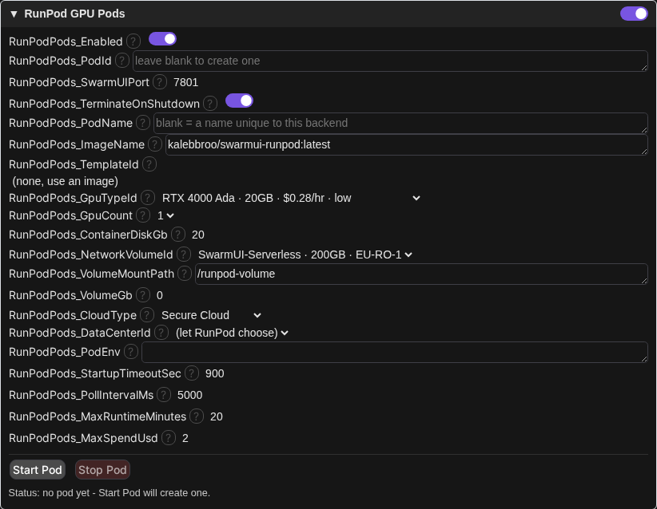
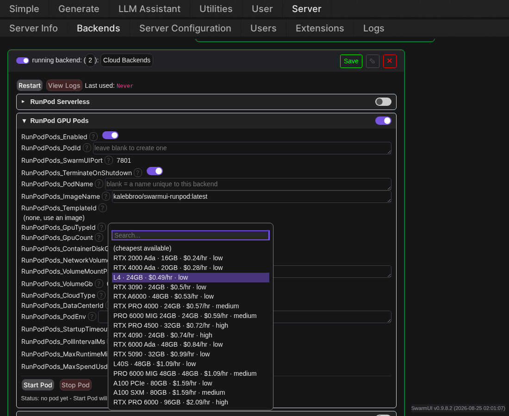
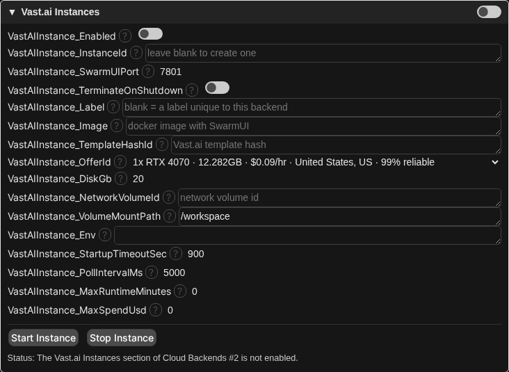
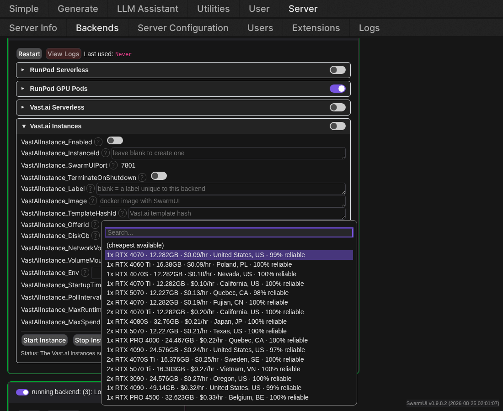
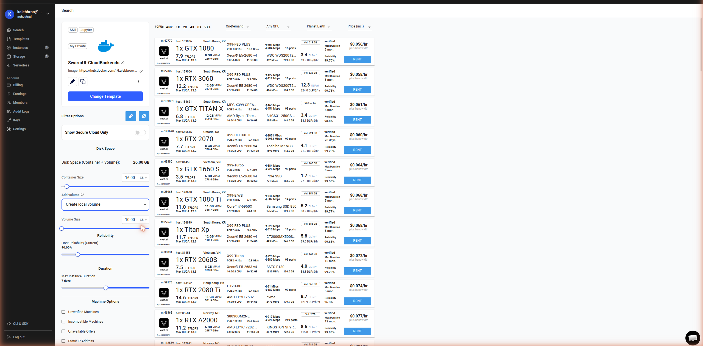
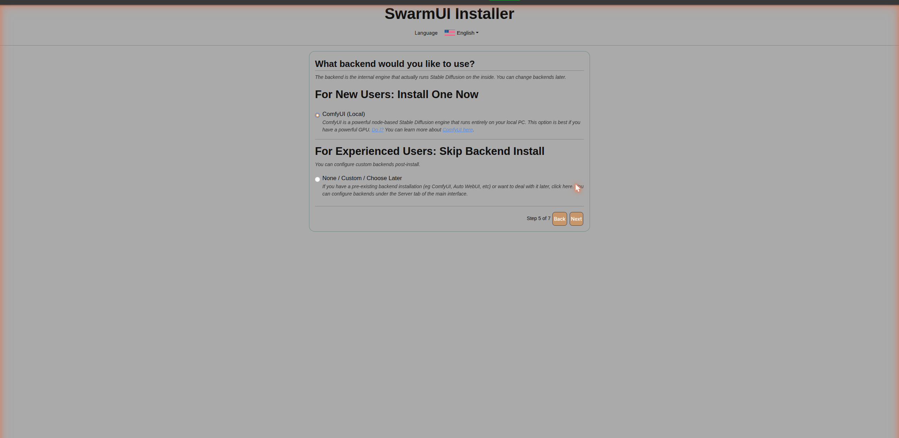
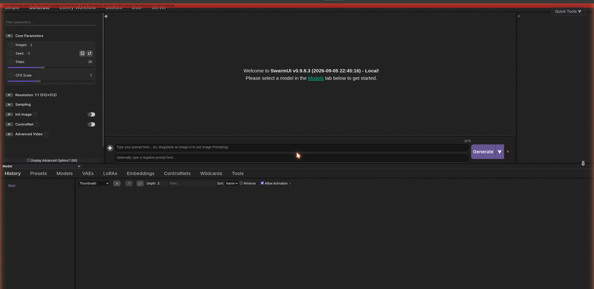

# SwarmUI-CloudBackends

Run your [SwarmUI](https://github.com/mcmonkeyprojects/SwarmUI) generations on cloud GPUs. Workers wake on demand when you generate and scale back to zero when idle, so you only pay while you're actually using a GPU.

One shared core handles the SwarmUI side; each cloud provider is a thin adapter. Adding a provider means implementing a small interface, not writing another backend.

## Provider status

| Provider | Status |
|---|---|
| RunPod Serverless | ✅ Verified end to end against real hardware, including generation. |
| RunPod Pods | ✅ Verified end to end live: create, attach, generate, Start/Stop, terminate. |
| Vast.ai Instances | ✅ Verified end to end live, including a full from-scratch volume + install. |
| Vast.ai Serverless | ✅ Verified live: worker recruited, `Ready 1/1`, routed and woken through Vast. Needs a worker image with a model baked in - see [Setup](#vastai-serverless). |

<details>
<summary><b>Deeper detail per provider</b></summary>

- **RunPod Pods**: create a pod, attach it as a real Swarm backend, generate, Start/Stop, terminate - all done live.
- **Vast.ai Instances**: verified against the official `vastai` Python SDK/CLI source, since the prose docs are vague (and sometimes wrong) on exact endpoints. Config/credentials, live offer search, Start/Stop/confirm/error UI, instance creation, networking, and a real generation are all live-verified. Creating a brand-new *named* network volume isn't supported yet (attaching an existing one is) - see [Known follow-ups](#known-follow-ups).
- **Vast.ai Serverless**: the worker ([`workers/vastai/vast_worker.py`](workers/vastai/vast_worker.py)) is a real `vastai`-SDK PyWorker, so it registers with the autoscaler and is genuinely routable, rather than a lookalike HTTP server that `/route/` would never return. Verified live end to end: a worker was recruited, reached `Ready 1/1`, and was routed and woken through Vast's own `/route/`. Unlike RunPod, Vast cannot attach a network drive to a serverless worker, so the model has to be in the worker image - see [Setup](#vastai-serverless).

</details>

## Setup

Every provider lives behind one **Cloud Backends** entry (**Server ▸ Backends ▸** *Show Advanced*), not four separate types:


Adding it gives you one card with a collapsible section per provider, each with its own toggle. No API key fields here - those stay in **User Settings ▸ API Keys**.


> [!IMPORTANT]
> Enabling a section and saving never starts (or bills) anything by itself. For "rent a whole instance" providers, it only makes the **Start** button usable - starting is always an explicit, confirmed action.

### RunPod Serverless

1. Deploy [RunPod-Worker-SwarmUI](https://github.com/HartsyAI/RunPod-Worker-SwarmUI) (`kalebbroo/swarmui-runpod:latest`) as an endpoint: network volume at `/runpod-volume`, ≥16 GB VRAM, ~15 GB container disk, execution timeout comfortably above your keepalive (3600s is safe), FlashBoot on.
2. Set your RunPod key in **User Settings ▸ API Keys**.
3. In the **RunPod Serverless** section: toggle on, set `EndpointId`, Save.

Your key and endpoint are validated against RunPod's health API immediately, so a bad value fails at setup instead of at your first generation.

### RunPod Pods

Set `PodId` to attach an existing pod, or leave it blank plus `ImageName`/`TemplateId` to create one. Leave `PodName` blank too - it defaults to a name unique to this backend, avoiding collisions between multiple Cloud Backends entries.

Once your API key is set, GPU type / network volume / data center / template / pod ID all become **live dropdowns** populated from your account - real availability and price, not a name typed from memory.



<details>
<summary>GPU Type dropdown, open</summary>



A field only stays a plain text box when your account genuinely has nothing to offer it yet (e.g. Pod ID before you've created any pods). Type by hand there if needed - it becomes a picker automatically once something exists to pick from.

</details>

> [!WARNING]
> The pod's own SwarmUI needs at least one backend of its own (ComfyUI, typically) before anything can generate through it. A pod with an empty backend list attaches successfully but has nothing to route to. Adding one after attaching is picked up automatically within a few seconds.

> [!WARNING]
> A worker image built for RunPod **serverless** generally won't work as a pod without support for both - a serverless-only entrypoint's job handler has no jobs to serve in a pod, exits immediately, and takes the container with it. [RunPod-Worker-SwarmUI](https://github.com/HartsyAI/RunPod-Worker-SwarmUI) supports both from one image, picking serverless-vs-pod mode from whether `RUNPOD_ENDPOINT_ID` is set.

`TerminateOnShutdown` (off by default) controls whether stopping the pod also destroys it. Off keeps the container disk around for a fast resume; only turn it on when a network volume already holds everything worth keeping. RunPod's proxy (`https://{podId}-{port}.proxy.runpod.net`) has no authentication of its own - don't put anything sensitive on a pod you wouldn't expose publicly. Attaching a `NetworkVolumeId` auto-places the pod in that volume's data center.

### Vast.ai Instances

Same shape as RunPod Pods (bills continuously until stopped, `TerminateOnShutdown` means the same thing, `Label` defaults to a unique name the same way `PodName` does), with a few differences:

- **Instances come from a specific rentable offer**, not an abstract GPU type. Leave `OfferId` blank to auto-search and take the cheapest match - Vast has no RunPod-style retry across candidates, so if that exact offer is gone by generation time, pick another from the live dropdown.
- **No proxy domain.** Vast maps your port to a random external port on a shared host IP, only known after creation, reachable at plain `http://{ip}:{port}` - no TLS, no auth. Same "don't expose anything sensitive" rule as RunPod, with weaker transport on top.
- **Creating a brand-new named network volume isn't supported yet** - attach one you already made on Vast via `NetworkVolumeId`. (See [below](#never-used-vastai-before) if you don't have one yet.)

Once your key is set, offer and network volume fields become live dropdowns the same way RunPod's do.



<details>
<summary>Offer dropdown, open</summary>



</details>

<details id="never-used-vastai-before">
<summary><b>Never used Vast.ai before? Create a volume and install SwarmUI from scratch</b></summary>

1. **Create a volume.** On [Search](https://cloud.vast.ai/search), pick a GPU and set **Add volume ▸ Create local volume** with the size you want.

   > [!NOTE]
   > Volumes are tied to the physical host you rent on - reattaching one to a later instance only works on that same machine.

   

2. **Rent it**, then open the instance once running. A fresh SwarmUI image runs its own first-time installer on first boot - same wizard as a local install, until the backend step:

   

   - **Using ComfyUI?** Pick **ComfyUI (Local)** and you're done - it installs and wires up automatically.
   - Want a different backend? Pick **None / Custom / Choose Later** instead.

3. If you'll reach this instance from outside the container, pick **"Just Yourself, with LAN access"** on the "who is this for" step, not "Just Yourself On This PC" - the latter refuses external connections regardless of what Vast does with the port.

4. SwarmUI boots fine with no backend - it just has nothing to generate with yet:

    Backends">

   Configure whatever backend you want under **Server ▸ Backends** from here.

</details>

### Vast.ai Serverless

> [!IMPORTANT]
> **You need your own worker image, with a model baked into it.** Vast, unlike RunPod, cannot attach a network drive to a serverless worker, so nothing persists between workers and there is nowhere to keep models. Your image has to contain SwarmUI, a backend, and the model you intend to generate with. Everything below assumes such an image; `kalebbroo/swarmui-runpod:latest` gets a worker running and routable but ships no model, so it will come up with nothing to generate.
>
> If you want cloud GPUs with your existing models on a drive, use **RunPod Serverless** (network volume, still scales to zero) or **Vast.ai Instances** (attaches a Vast volume) instead.

Vast's serverless is three nested objects: an **endpoint** (the autoscaling policy) contains **workergroups** (a template plus GPU-pool filters), which recruit real **instances**. You configure all three on Vast, then point this extension at the endpoint.

1. **Create a template** ([Templates ▸ New](https://cloud.vast.ai/templates/)) with your image, launch mode **Docker ENTRYPOINT**, and:

   - Docker options: `-p 7801:7801 -p 8000:8000 -e VOLUME_PATH=/workspace -e SWARM_MODE=vast_serverless -e WORKER_PORT=8000`
   - Ports `7801` (SwarmUI) and `8000` (the PyWorker Vast talks to) both exposed
   - **Container disk** comfortably larger than your unpacked image - see the warning below

2. **Create an endpoint** ([Serverless](https://cloud.vast.ai/serverless/)): Min Workers `0`, Max Workers `1` to start, Min Load `1`, Target Utilization `0.9`, Cold Multiplier `3.0`.

3. **Create a workergroup** under it, choosing that template. Its GPU-pool filters inherit the template's disk size, so fix the disk on the template first.

4. Set your Vast key in **User Settings ▸ API Keys**, then in the **Vast.ai Serverless** section: toggle on, set your endpoint name, Save.

> [!IMPORTANT]
> **Set container disk well above your image's unpacked size.** Vast's default is 8 GB, which is smaller than most usable worker images, and an undersized disk fails in a way that names no cause: instances die partway through the pull and the autoscaler quietly rotates to another host forever, never reaching `Ready Workers: 1/1`.

Two things your image must do, since a serverless worker gets a bare container every time:

- **Ship a configured backend**, not just SwarmUI. A SwarmUI with no backend starts normally and then cannot generate anything.
- **Not require `VOLUME_PATH` to already exist.** There is no volume, so that path is just a directory on container disk that nothing creates for it.

<details>
<summary><b>Editing a template does not update it in place</b></summary>

Saving from **Templates** creates a *new* template rather than modifying the existing one, and your workergroup keeps pointing at the old copy. It is easy to end up with several identically-named templates and "verify" the wrong one - during this extension's own testing that hid a workergroup still running a months-old image tag while a duplicate template showed the current one.

Edit the template through **Serverless ▸ Edit workergroup ▸ (pencil)** instead, which shows the config the workergroup actually uses, and use **Save & Use**. Editing an existing workergroup can also fail with `search_params and search_query conflict`; deleting it and creating a fresh one under the same endpoint works.

</details>

## How it works

Two shapes of provider, because "wake a serverless worker per request" and "rent an instance that stays up" need different lifecycles.

<details>
<summary><b>Architecture</b></summary>

**Serverless** (RunPod Serverless, Vast.ai) wakes a worker on the first generate, then hands its URL to a swarm child exactly like an instance does:

```
  ICloudProvider                 CloudBackendBase : AbstractT2IBackend
    WakeupWorkerAsync    ---->     Wakes a GPU on the first generate, attaches an
    StartKeepaliveAsync            OwnerBoundSwarmBackend to it, and hands that first
    StopKeepaliveAsync             request to the worker's own mirrored backends.
    ValidateAsync                  Afterwards it steps aside and core routes to them.

  CloudWorkerInfo { PublicUrl, SessionId, WorkerId, Version }
```

The child is attached only while a worker is awake, which is what makes using core's `SwarmSwarmBackend` safe here: its idle polling would otherwise be a standing reason to keep a pay-per-second worker billing, but with nothing attached while asleep it only ever polls a worker that is already awake and already being paid for.

So this backend is not in the generation path at all once a worker is up. What it keeps is the part only it can do: deciding when to spend money. It accepts a request only when no worker is awake, and takes one at a time, so a second request during a cold start waits for the mirrored backends rather than starting a duplicate wake.

Keepalive follows real use rather than a fixed window: the child tells this backend before each generation, which tops the worker up, so a long generation cannot outrun its own keepalive. The child is dropped once the keepalive lapses and the subtree goes quiet. Between the worker's keepalive expiring and the next check (up to 5 seconds) the child is briefly still attached, so a request in that window either revives a worker that is still up, or fails once and cold-wakes cleanly on the retry.

While asleep this backend answers for the models the worker had, copied from the child before it was dropped, so a sleeping endpoint still offers its models and only wakes for a request it can actually serve.

**Instance rental** (RunPod GPU Pods, Vast.ai Instances) stays up until you stop it, so there's no reason to reimplement the remote protocol - this backend just drives the provider's API to get SwarmUI running, then hands the URL to a swarm backend child and steps out of the way:

```
  ICloudInstanceProvider          CloudInstanceBackendBase : AbstractT2IBackend
    StartInstanceAsync   ---->      Starts (or creates) the instance, then attaches
    ReleaseInstanceAsync            an OwnerBoundSwarmBackend (core's SwarmSwarmBackend
    ValidateAsync                   plus an owner check) to its URL as a child. That
                                     child does everything from there: sessions, model
                                     listing, generation, websockets, previews.

  CloudInstanceInfo { PublicUrl, InstanceId, Description }
```

Sessions, model sync, parameter forwarding and generation are core Swarm code in both shapes now, delegated to the attached child rather than reimplemented here. What differs is only the lifecycle: an instance keeps its child for as long as it is rented, a serverless worker only while it is awake.

`CloudBackendsBackend` is the one publicly registered type; each provider's own `BackendType` is built without the public registry, so it's usable as a hidden child without being independently addable (`CloudBackendTypes`). Serverless remote models merge into the model browser via `ExtraModelProviders`; a pod's models reach it through core's own `remote_swarm` provider instead, since the attached `SwarmSwarmBackend` is a real backend as far as core is concerned. Every action is reachable over the plain API (`CloudGetStatus`, `CloudRefreshModels`, `Cloud{Start,Stop,GetStatus}Pod`, `VastAI{Start,Stop,GetInstance}Status`, `CloudListProviders`), with `...WS` websocket variants for streaming progress while a cold instance boots.

</details>

## Per-user tenancy

Every cloud backend belongs to exactly one user and runs on that user's own key:

- No key on file → clean refusal, never another user's worker or bill.
- Your generations only route to (and are only accepted by) your own cloud backends - serverless workers and attached instance backends alike.
- Changing your key takes effect on next use automatically.
- A created pod/instance is remembered per user and reattached after a restart instead of billing a second one; find-by-name/label is the fallback.

> [!IMPORTANT]
> An implicitly-created backend never spends money by itself. A sleeping serverless backend has nothing attached to it, so nothing polls and nothing can wake a billed worker behind your back; it answers for its models from the last time one was awake, and refreshing them for real is an explicit action (the refresh route). Instance backends never auto-start (use Start).

> [!WARNING]
> **`EndpointId` is shared by every user, while the API key is per-user** - each user's child is built from the same backend settings and only differs by whose key it runs on. Pods and instances are unaffected (they are *created*, and their name/label is already made unique per user), but the two serverless providers look up something that has to exist in the caller's own account:
>
> - **RunPod Serverless is owner-only.** Its endpoint ID is account-scoped and goes straight into the request URL, so any user other than the one whose account owns that endpoint gets `RunPod endpoint '...' not found (404)`. There is no per-user endpoint setting to point them elsewhere.
> - **Vast.ai Serverless works for multiple users** only because it resolves by endpoint *name* within each caller's own account - so every user needs their own endpoint, named exactly the same.
>
> For a multi-user server, prefer pods/instances, or give each user their own Cloud Backends entry with their own endpoint.

## Concurrency and scaling

One backend instance owns exactly one worker. Concurrency is whatever the worker's own backends report, since those are what core routes to; the `MaxConcurrent` setting no longer does anything and is kept only so existing configs still load. To use more than one GPU, add more **Cloud Backends** entries, each with its own provider section - each one wakes and owns its own worker. Generation traffic never enters RunPod's own job queue, so its autoscaler won't add workers for this load.

Local backends are still preferred while they are free: a cloud backend is only picked once every local one is busy, which wakes a worker. That is the "generate locally, overflow to a cloud GPU" arrangement, and it is unchanged by any of the above.

## Troubleshooting

| What you see | What it means |
|---|---|
| `RunPod API key was rejected (401)` | The key in User Settings is wrong or revoked. |
| `RunPod endpoint '...' not found (404)` | `EndpointId` doesn't match a real endpoint. |
| `Cloud worker '...' is running SwarmUI, but that SwarmUI has no backends configured` | Open the worker URL in the message, go to Server ▸ Backends, add one. |
| `Cloud worker '...' refused to load model '...'` | Model isn't present on the worker, or its backend can't load it. |
| `did not complete within Ns` | Worker didn't wake in time - raise `StartupTimeoutSec`, or check the console for capacity. |
| Pod/instance shows `running`, but generation says no backend matches | Its own SwarmUI has no backend configured. Add one directly on it; picked up within seconds. |
| `Could not create a RunPod pod on any candidate GPU` | Every GPU tried was unavailable/rejected - check balance, or set `GpuTypeId` explicitly. |

For anything else, run with `--loglevel verbose` and look for `[RunPod Serverless]` / `[CloudBackends]`.

<details>
<summary><b>Two RunPod behaviors worth knowing</b></summary>

**Cancelling a running job terminates the worker executing it.** So "cancel the old keepalive, submit a new one" kills the very worker you're trying to keep alive - a healthy worker died ~13s after such a cancel in testing, every later proxy call returning empty. Keepalives are blocking and run one at a time, so this extension extends a worker with an *additional* queued job instead. Outstanding jobs are only cancelled on shutdown, where ending the worker is the point.

**A cold worker's proxy answers with empty bodies** for the first few minutes - byte-for-byte identical to a dead one. The backend waits it out rather than concluding the worker died, so a cold start costs one wake instead of a cascade.

</details>

<details>
<summary><b>Measured behavior (live runs)</b></summary>

Serverless, RTX-class worker, SDXL 1024×1024 @ 12 steps:

| Operation | Time |
|---|---|
| Wake onto a FlashBoot warm worker (incl. discovering 27 models) | 15-40 s |
| Fully cold worker, container start to first image | 3-4 min |
| First generation on an already-woken worker | ~64 s |
| Warm generation, worker + model resident | ~9 s |
| Recovery from an invalidated remote session | ~9 s, no re-wake |
| Teardown to zero workers/queued jobs | immediate on disable |

**Pods**: create → SwarmUI answering (RTX PRO 4500 Blackwell, warm volume) ~3 min; backend attaches and reaches `running` within seconds; generation ~60s incl. ComfyUI's model load; termination on disable is immediate.

**Per-user tenancy**, real account (RTX 2000 Ada, auto-picked cheapest): child spawned on demand, pod up + SwarmUI answering ~3 min, real image in 70s (mostly one-time load), cleanly terminated (confirmed zero pods left via RunPod's own listing). Total lifetime ~7 min, ~$0.03.

</details>

## Development

```bash
dotnet build src/Extensions/SwarmUI-CloudBackends/SwarmUI-CloudBackends.csproj -c Release
```

or just launch SwarmUI, which builds extensions at startup.

> [!TIP]
> SwarmUI caches the built extension DLL against this repo's git HEAD, so Release mode skips rebuilds until there's a new commit. Use the dev launch script, or delete `src/bin/extensions/SwarmExtensionSwarmUI-CloudBackends/` after editing.

<details>
<summary><b>Which APIs this targets</b></summary>

- **RunPod Pods** uses REST API **v2** (`api.runpod.io`). v1 retires 2026-11-15, GraphQL in early 2027 - neither is safe to target, and v2 isn't a rename: status is one observed value across six states rather than v1's three-state `desiredStatus`, state changes go through one `/action` endpoint, and field names differ.
- **RunPod Serverless** uses the job API at `api.runpod.ai/v2/{endpointId}/` (`run`, `status`, `cancel`, `health`) - a separate host from the REST control plane (`.ai` vs `.io`), easy to mix up since both use `/v2/`. Hitting the control-plane host with an endpoint ID just 404s.
- **Vast.ai Serverless** uses `POST run.vast.ai/route/` for routing plus the console REST API (`console.vast.ai`) for endpoint lookup. The grant `/route/` returns is forwarded to the worker verbatim as `auth_data`, since its signature covers those exact fields.
- **Vast.ai Instances** uses the same console REST API (auto-prefixed `/api/v0`), verified against the official `vastai` Python SDK/CLI source rather than the prose docs. Create is `PUT /api/v0/asks/{offerId}/`; start/stop are both `PUT /api/v0/instances/{id}/` with `{"state": "running"|"stopped"}` - not separate endpoints or RunPod's `/action` shape. Port exposure is a Docker `-p` flag in an `env` dict; the assigned external port is only known after creation (`GET /api/v0/instances/{id}/`, Docker-inspect shaped).

</details>

<details id="known-follow-ups">
<summary><b>Known follow-ups</b></summary>

- **Creating a brand-new named Vast.ai network volume** isn't supported - only attaching an existing one is. Vast's volumes are rented from their own marketplace (`POST /api/v0/network_volumes/search/`), out of scope for this pass.
- The serverless worker handler returns its cached SwarmUI session without revalidating it; this extension compensates by refreshing in place on `invalid_session_id`.
- All requests through one backend share a single remote session, so an interrupt cancels every in-flight generation on that worker.
- No rate-limit backoff for RunPod (Vast's client already backs off on 429/502/503/504): a RunPod 429 mid-poll surfaces as an error instead of pausing on `Retry-After`.
- No orphaned-instance detection: if SwarmUI dies uncleanly while a section is *disabled* but its instance is still running, nothing notices on next start. (Re-enabling the section, or an instance created while it was still enabled, is found again by label/name - this only bites the disabled-with-a-stray-instance case.)

</details>

## Notes

- API keys are stored cleartext in `Data/Users.ldb` (and its backups) by core's per-user key store - protect that directory. Masking there is core's to fix, not this extension's.
- Cloud models must be discovered before you can generate with them: call `/API/CloudRefreshModels` once per server start (deliberately manual, since it wakes a billed worker).
- The model *list* merges across users' serverless backends (core's hook carries no user context); generation itself stays strictly per-user.
- Editing the Cloud Backends card restarts it, dropping every user's hidden children - they're recreated fresh on next use.
- `GenerationTimeoutSec` above 600 is capped by the shared HTTP client's 10-minute ceiling. `KeepaliveSeconds` (default 420) is what you pay for while idle - it's auto-raised to at least `GenerationTimeoutSec` + 2 min so a worker never dies mid-generation.

## License

MIT
