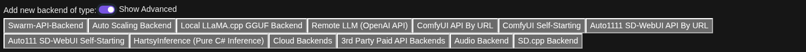
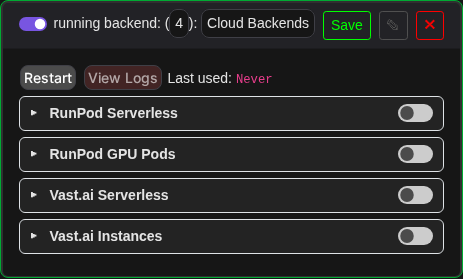
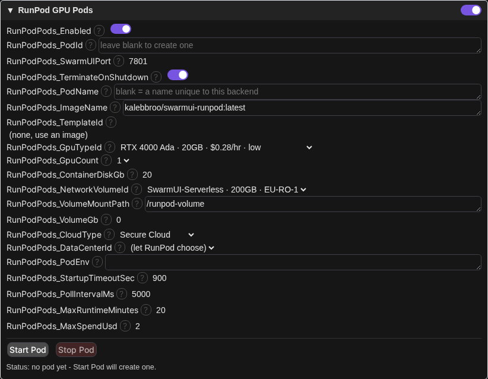
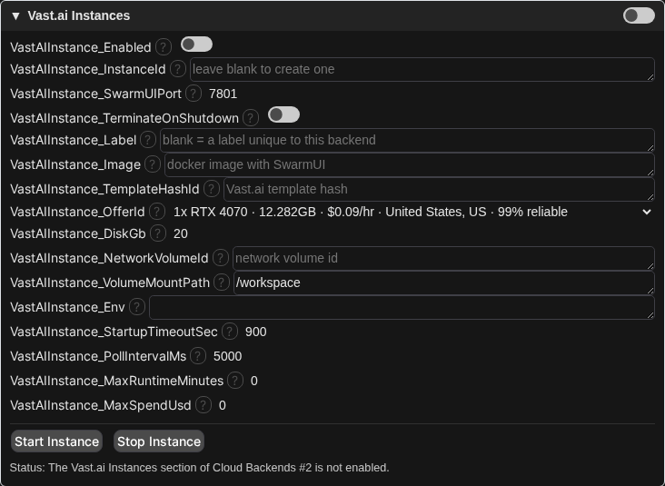

# SwarmUI Cloud Backends

Run your [SwarmUI](https://github.com/mcmonkeyprojects/SwarmUI) generations on cloud GPUs from RunPod and Vast.ai. Add one backend, generate as usual, and SwarmUI starts a cloud GPU when it needs one, adds more when you are busy, and shuts them down when you stop. You pay only while a GPU is working for you.

By Hartsy. MIT licensed.

## Providers

| Provider | What it is | Billing | Best for |
|---|---|---|---|
| **RunPod Serverless** | Workers that start on demand and shut down when idle. Scales out automatically. | Per second while a worker runs | Most people. Bursty or occasional use, models on a network volume. |
| **Vast.ai Serverless** | The same on Vast.ai's marketplace. The model is baked into your worker image. | Per second while a worker runs | Cheaper GPUs, when you are happy to build an image with your model in it. |
| **RunPod GPU Pods** | A whole GPU machine you start and stop from the card. | Per hour while running | Long sessions, or when you want the machine to stay warm. |
| **Vast.ai Instances** | The same on Vast.ai. | Per hour while running | Long sessions at marketplace prices. |

## Requirements

- SwarmUI (current release).
- An account with RunPod and/or Vast.ai, with credit.
- For serverless: an endpoint running the Hartsy worker image. Setup is below.
  - RunPod: [`kalebbroo/swarmui-worker-runpod`](https://github.com/HartsyAI/RunPod-Worker-SwarmUI)
  - Vast.ai: an image built from [`kalebbroo/swarmui-worker-vast`](https://github.com/HartsyAI/Vast-Worker-SwarmUI)

## Installation

In SwarmUI, open **Server ▸ Extensions**, find **Cloud Backends**, and install it. SwarmUI restarts to load it.

To install by hand instead, clone this repository into `SwarmUI/src/Extensions/` and restart SwarmUI.

## Quick start

1. Put your provider API key in **User Settings ▸ API Keys** (RunPod and/or Vast.ai). Keys are per user; each user's cloud usage runs on their own key.
2. Open **Server ▸ Backends**, turn on **Show Advanced**, and add **Cloud Backends**.

   

3. The card has one collapsible section per provider. Turn one on, fill in its settings (see the provider setup below), and save.

   

4. Generate. That's it.

Saving the card never starts or bills anything by itself. Serverless workers start only when a generation needs one; pods and instances start only when you press **Start**.

## How generation is routed

- **Local first.** If you have a local GPU backend that is free and has the model, it takes the generation. The cloud is used when your local backends are busy, or do not have the model.
- **A worker starts when needed.** The first cloud generation starts a worker (a cold start takes from under a minute with a warm worker to a few minutes from scratch). Later generations go straight to the running worker.
- **More workers under load.** If every running worker is busy and another generation arrives, another worker starts, up to **Max Workers**. If a busy worker frees up first, it takes the generation instead.
- **Workers shut down when idle.** After **Idle Seconds** with no generation, a worker shuts down and stops billing. The next generation starts one again.

## Models

SwarmUI only offers models it knows about. There are two ways a cloud endpoint's models become known:

- **You have the model locally** (for example, the same files as on your RunPod volume). Pick it and generate; the first cloud generation also teaches SwarmUI every other model the endpoint has.
- **You don't.** Press **Discover models** in the serverless section once. It starts a worker (billed until it goes idle), reads its model list, and adds those models to your model list.

Either way the list is remembered per user and endpoint, across restarts. Use the `CloudClearModelCache` API route if you change what is on the endpoint.

## RunPod Serverless setup

1. **Network volume.** In RunPod, create a network volume in the data center you want. Put your models in `Models/` at its root, using SwarmUI's folder names: `Models/Stable-Diffusion`, `Models/Lora`, `Models/VAE`, and so on.
2. **Endpoint.** Create a **Queue** serverless endpoint from `kalebbroo/swarmui-worker-runpod:<version>-comfyui` (or `-hartsyinference`), pinned to a release version:

   | Setting | Value |
   |---|---|
   | Network volume | the volume from step 1 |
   | GPU | 16 GB VRAM or more (24 GB for large models) |
   | CUDA version | 12.8 or newer |
   | Container disk | 30 GB (ComfyUI) or 15 GB (HartsyInference) |
   | Active workers | 0 |
   | Max workers | at least your **Max Workers** below |
   | Execution timeout | longer than **Max Lease Seconds** (e.g. 4200 s for the default 3600) |
   | FlashBoot | on |

3. **Card.** In the **RunPod Serverless** section, turn it on and set:

   | Setting | Meaning |
   |---|---|
   | Endpoint ID | The endpoint's ID from the RunPod console. |
   | Max Workers | Most workers that may run at once. 1 means never more than one. |
   | Idle Seconds | How long a worker may sit with no generation before shutting down. Lower costs less; higher avoids cold starts between bursts. |
   | Max Lease Seconds | Longest a worker is held before it is handed back and leased again. Keep it under the endpoint's execution timeout. |
   | Startup Timeout | How long to wait for a worker to start. |

4. Press **Validate** in the section. It checks the endpoint's settings against the card (execution timeout, max workers, image version) and tells you what to fix. It costs nothing.

## Vast.ai Serverless setup

Vast.ai serverless workers cannot attach a volume, so **your model must be inside the worker image**. Build one from the Hartsy Vast worker:

```bash
git clone https://github.com/HartsyAI/Vast-Worker-SwarmUI && cd Vast-Worker-SwarmUI
docker build --build-arg BACKEND=hartsyinference --build-arg BASE_VERSION=<version> \
  --build-arg BAKE_MODEL_URL=https://example.com/my-model.safetensors \
  --build-arg BAKE_MODEL_SHA256=<sha256 of the file> \
  -t <you>/swarmui-worker-vast:<version>-mymodel .
docker push <you>/swarmui-worker-vast:<version>-mymodel
```

Then on Vast.ai:

1. **Template** ([Templates ▸ New](https://cloud.vast.ai/templates/)): your image, launch mode **Docker ENTRYPOINT**, Docker options `-p 7801:7801 -p 8000:8000 -e WORKER_PORT=8000`, and a container disk well above the image's unpacked size (e.g. 40 GB). Vast's 8 GB default is too small, and an undersized disk fails without saying why.
2. **Endpoint** ([Serverless](https://cloud.vast.ai/serverless/)): **Min Workers 0**, **Min Load 0**, and an **Inactivity Timeout** (e.g. 300). With Min Load above 0 the endpoint never scales to zero; with Min Workers above 0 Vast keeps stopped workers that bill for storage. Set **Max Workers** to at least your card's Max Workers.
3. **Workergroup** under the endpoint, using the template, with a GPU filter of 16 GB VRAM or more. To change the template later, edit it through **Serverless ▸ Edit workergroup**, because saving from Templates creates a new copy the workergroup does not use.
4. **Card:** turn on **Vast.ai Serverless**, set **Endpoint ID** to the endpoint's **name**, and set Max Workers and Idle Seconds as above (Vast.ai workers are kept at least 60 seconds). Press **Validate**.

## RunPod GPU Pods

Leave **Pod ID** blank to have the card create a pod, or set it to use an existing one. With your API key set, the GPU type, network volume, data center and template fields become dropdowns filled from your account, with live prices and availability.



- **Image** defaults to the Hartsy RunPod worker, pinned to a release. The card gives the pod an access token automatically, so nobody else can use it.
- **Start** creates or resumes the pod (you confirm the price first); **Stop** stops it. **Terminate On Shutdown** destroys the pod instead of stopping it, which only makes sense when a network volume holds everything worth keeping.
- **Max Runtime Minutes** and **Max Spend USD** stop the pod automatically if you forget.
- To use a pod you created yourself, it must run the Hartsy worker image; put its `SWARMUI_WORKER_TOKEN` in **Worker Token**. Letting the card create the pod is simpler: it then manages the token for you.

## Vast.ai Instances

The same as pods, with Vast.ai's differences:

- An instance comes from a specific **offer** (a particular machine). Leave **Offer ID** blank to take the cheapest match, or pick one from the live dropdown.

  

- Vast.ai has no proxy domain; the instance is reached at its public IP over **HTTPS**, using the certificate Vast.ai issues to every instance. The card checks it against Vast.ai's own root certificate.
- Attach an existing network volume with **Network Volume ID**. Creating a new named volume is done on Vast.ai's site.
- To use an instance you created yourself, it must run the Hartsy Vast worker image; put its `SWARMUI_WORKER_TOKEN` in **Worker Token**.
- When you pick a **Template**, the template's image is used and the Image setting is ignored.

## Keeping costs under control

- Serverless workers shut down after **Idle Seconds**; nothing keeps one running unless you are generating.
- If SwarmUI stops unexpectedly, RunPod workers still shut themselves down when idle, and Vast.ai sessions expire on their own.
- The card shows a warning when a pod or instance created by Cloud Backends (under any name) is running but not attached to any card, for example after SwarmUI stopped uncleanly. Stop it from there.
- The **Workers** list in each serverless section shows every running worker, with a **Stop** button.
- **Validate** catches endpoint settings that would keep workers running or billing (Vast.ai Min Load, missing inactivity timeout, execution timeouts).

## Security

- Every worker, pod and instance only accepts requests carrying its access token. Serverless workers get a new token for each lease, which stops working the moment the worker is released; pods and instances get a per-user token the card manages.
- Vast.ai connections use TLS verified against Vast.ai's root certificate.
- Your provider API keys, and pod and instance tokens, are stored by SwarmUI in `Data/Users.ldb`. Protect that directory.
- Each user's cloud backends run on their own API key and only accept their own generations.

## Permissions

| Permission | Allows |
|---|---|
| Use RunPod Serverless | Generating on RunPod Serverless workers. |
| Use RunPod GPU Pods | Starting, stopping and generating on RunPod pods. |
| Use Vast.ai | Generating on Vast.ai Serverless workers. |
| Use Vast.ai Instances | Starting, stopping and generating on Vast.ai instances. |
| Cloud Backends Status/Refresh | Viewing workers and status, discovering models, validating, and stopping workers and orphans. |

All default to power users. Adding the Cloud Backends card itself needs SwarmUI's normal backend permissions.

## API

Everything the card does is available through SwarmUI's API. See [docs/APIRoutes/CloudBackendsWebAPI.md](docs/APIRoutes/CloudBackendsWebAPI.md) for every route, its parameters and its responses.

## Limitations

- **Endpoint settings are shared by all users of one card; API keys are per user.** A RunPod endpoint belongs to one account, so only that account's user can use a RunPod Serverless section. For Vast.ai, every user needs their own endpoint with the same name. On a multi-user server, give each user their own card, or use pods and instances.
- **The model list is shared across users** of the same server (SwarmUI's model list has no per-user view). Generation itself is per user.
- **Editing the card restarts it**, which releases every user's running workers. They start again on next use.
- **Stopping a generation stops every generation on that worker**, because they share one session on the worker.

## Troubleshooting

| Message | What to do |
|---|---|
| `RunPod rejected the API key` / `Vast.ai rejected the API key` | Check the key in User Settings ▸ API Keys. |
| `RunPod endpoint '...' was not found` | Check the Endpoint ID, and that the endpoint belongs to your account. |
| `The RunPod worker image is too old` | Point the endpoint at `kalebbroo/swarmui-worker-runpod` 2.0.0 or later. |
| `No RunPod worker picked up the lease` / `No Vast.ai worker became available` | The provider had no GPU for you in time. Check the endpoint's max workers and GPU choices, or raise Startup Timeout. |
| `worker ... is running SwarmUI with no backend configured` | The worker image is not a Hartsy worker image, or is broken. |
| `worker ... refused its lease token` | The worker was released (idle, or stopped). The next generation starts a new one. |
| A model is missing from the list | Press **Discover models**, or clear the remembered list with `CloudClearModelCache` if the endpoint's models changed. |
| Workers keep running after you stop | Press **Validate**; on Vast.ai, check Min Load is 0 and an Inactivity Timeout is set. |

For more detail, run SwarmUI with `--loglevel debug` and look for lines tagged `[RunPodServerless]`, `[VastAI]` or `[CloudBackends]`.

## For developers

How it works inside: [docs/ARCHITECTURE.md](docs/ARCHITECTURE.md). Tests: `dotnet test src/Extensions/SwarmUI-CloudBackends/Tests` after building SwarmUI.

## License

MIT, see [LICENSE](LICENSE).
